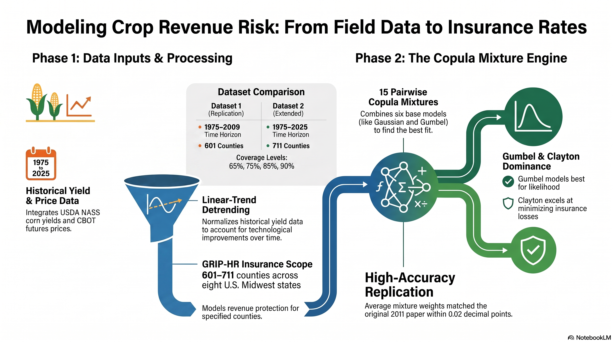

# Crop Revenue Insurance — Copula Mixture Replication



Replication of **Ghosh, Woodard & Vedenov (2011), "Efficient Estimation of
Copula Mixture Models: An Application to the Rating of Crop Revenue
Insurance"** (AAEA 2011 selected paper, included in [`paper/`](paper/)),
plus construction of the two datasets defined in
[`specs/data-specs.md`](specs/data-specs.md).

The paper rates GRIP-HR (Group Risk Income Protection with the Harvest
Revenue option) county corn revenue insurance in eight Midwest states using
six copulas (Gaussian, Student-t, Frank, Gumbel, Clayton, kernel) and their
15 pairwise mixtures, with mixture weights chosen out-of-sample by
leave-one-out cross-validation under two objectives (squared-loss
minimization and out-of-sample log-likelihood).

## Layout

```
paper/                          the research paper (PDF + markdown)
specs/data-specs.md             the data specification
src/
  filter_nass.py                NASS bulk dump -> county corn yields CSV
  build_prices.py               base/harvest price series 1972-2025
  build_datasets.py             builds Dataset 1 + Dataset 2 + aux tables
  copulas.py                    six bivariate copulas (fit / logpdf / sample)
  replicate_paper.py            full replication (Tables 1-8 analogs)
  enrich_spatial.py             county centroids + adjacency (benchmark layer)
  reshape_benchmark.py          synthetic-data benchmark tracks (separate output)
data/
  raw/                          NASS extract, price-table provenance
  processed/                    the two panel datasets + aux tables
  benchmark/                    tabular synthetic-data benchmark tracks
results/                        replication outputs (see below)
docs/
  replication-specs.md          reverse-engineered paper spec + data diffs
  data-dictionary.md            column-by-column data dictionary
  results-comparison.md         our results vs the paper's tables
  benchmark-schema.md           synthetic-data benchmark schema + column roles
```

## Synthetic-data benchmarking layer

A separate, additive layer reshapes the panel for benchmarking copula-, DL-,
and MICE-based tabular generators on actuarial metrics (tail extrapolation,
heterogeneous tail dependence, spatial dependence, downstream rating utility).
It writes only to `data/benchmark/` and does not touch the replication data or
`results/`. Two tracks — **year-as-row** portfolio format (spatial units as
columns, on a state→ASD→county resolution ladder) and a high-n
**county-year-as-row** conditional format — plus centroid/adjacency spatial
files. Full column-role taxonomy (deterministic vs. stochastic vs.
target/predictor) and the metric-to-track map are in
[`docs/benchmark-schema.md`](docs/benchmark-schema.md).

```bash
python src/enrich_spatial.py       # needs Census reference files in data/raw/spatial/
python src/reshape_benchmark.py
```

## The two datasets

| | Dataset 1 (replication) | Dataset 2 (extended) |
|---|---|---|
| File | `data/processed/corn_grip_panel_1975_2009.*` | `data/processed/corn_grip_panel_extended.*` |
| Years | 1975–2009 | 1975–2025 |
| Counties | 601 (complete 35-year records; paper had 602) | 711 (all with data) |
| Trends | fitted 1975–2009 | fitted 1975–2025 **and** 1975–2009 |

Both contain observed yields, linear-trend detrending (level and ratio
residuals), base/harvest prices (Feb/Oct averages of December CBOT corn
futures), price ratio and % change, revenue, county APH, and GRIP-HR
guarantees/indemnities at 65/75/85/90% coverage. See
[`docs/data-dictionary.md`](docs/data-dictionary.md).

## Reproducing everything

```bash
pip install -r requirements.txt

# 1. download the NASS Quick Stats bulk dump (~1.1 GB) into data/raw/
#    https://www.nass.usda.gov/datasets/  ->  qs.crops_YYYYMMDD.txt.gz
python src/filter_nass.py

# 2. price series and panel datasets
python src/build_prices.py
python src/build_datasets.py

# 3. replication (about 2 minutes on a modern multi-core machine)
python src/replicate_paper.py --nsim 5000
```

`replicate_paper.py` options: `--sigma` (price volatility; default 0.36 = the
2009 RMA corn volatility factor recovered by calibration, `0` = historical
estimate), `--nsim`, `--workers`, `--max-counties`.

## Findings (vs the paper)

* **Gumbel is the dominant single copula under the OSLL criterion** (best in
  37% of counties here vs 47% in the paper), and **Clayton dominates under
  loss minimization at every coverage level**, increasingly so at higher
  coverage — both headline findings replicate.
* **Gumbel–Clayton is the leading non-kernel mixture under OSLL**, and the
  average mixture weights match the paper's Table 6 closely (e.g. Gumbel
  weight in Gumbel–Clayton: 0.77 here vs 0.79 in the paper).
* **Clayton produces the lowest rates and the kernel/Gumbel the highest**,
  with rate levels within ~10–20% of the paper's Table 7 after calibrating
  the two rating parameters the paper treats as "given" (base price $4,
  price volatility 0.36).
* Full table-by-table comparison: [`docs/results-comparison.md`](docs/results-comparison.md).
* Every reverse-engineered assumption and each difference between the paper's
  data and the data specs is documented in
  [`docs/replication-specs.md`](docs/replication-specs.md) — notably: 601 vs
  602 counties (NASS revisions since 2011), the abstract's "1973" vs the data
  section's 1975 start year, the spec's single coverage level vs the paper's
  four, and published Feb/Oct price averages in place of non-redistributable
  daily futures settlements.

## Data sources

* **Yields:** USDA NASS Quick Stats (survey county estimates), corn grain,
  bu/acre.
* **Prices:** crop-insurance projected/harvest prices (Feb/Oct averages of
  the December CBOT corn contract): farmdoc daily (1972–2015), AFBF Market
  Intel (2016–2018), RMA price discovery via cropcoverage.com and farmdoc
  daily (2019–2025).
